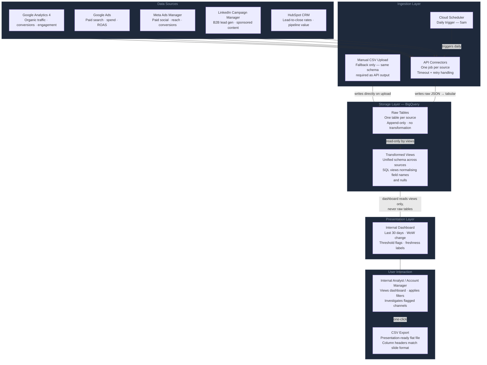

# Flow Diagram — Marketing Performance Tool

This diagram shows the full data and user interaction flow for the internal marketing performance tool. Read it left to right, top to bottom: data originates at the sources, gets pulled on a schedule, lands in BigQuery, is transformed into a unified view, and surfaces to the analyst through a dashboard.

---

## Design Decisions in This Diagram

**Why the dashboard reads views, not raw tables.**  
Raw tables accumulate every append. If the dashboard queried raw tables directly, a schema change in one source would break the dashboard query immediately. The transformation view layer acts as a contract: it absorbs schema changes and always presents the same interface to the dashboard.

**Why the manual upload writes to raw, not to views.**  
The upload goes through the same raw table so that the same transformation views apply. A separate ingestion path for manual data would create two sources of truth for the same metric.

**Why scheduling is external (Cloud Scheduler) rather than in-app.**  
Putting the schedule outside the pipeline means the pipeline itself is stateless and rerunnable. Cloud Scheduler can be paused, modified, or replaced without touching a single line of pipeline code. This also makes the transition to a more robust orchestrator (Airflow, Cloud Composer) trivial — you just point the trigger at a different endpoint.

**What is deliberately absent from this diagram.**  
There is no client-facing layer, no alerting layer, and no recommendation engine. These are v2+ decisions. The diagram shows only what v1 builds.
